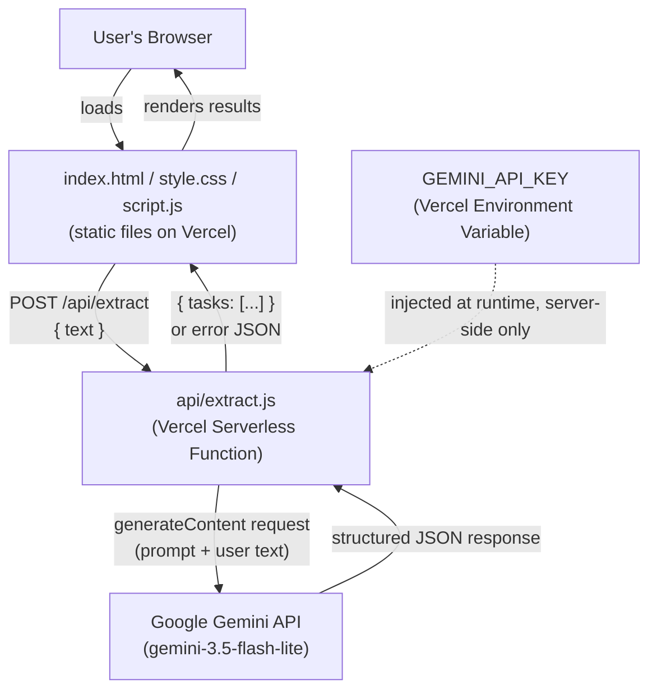

# TaskSpark — Architecture (Updated Day 3)

**Day 2 original, updated Day 3 to reflect the AI provider change.** Source of truth for system design, alongside the PRD and Implementation Blueprint.

---

## ⚠️ Day 3 Update Notice

The AI provider was changed from **Anthropic Claude** to **Google Gemini** on Day 3, at the builder's explicit request. This is a real architectural change, documented here for consistency. See `docs/ENVIRONMENT.md` and `docs/DAY3-SUMMARY.md` for full context, including the flagged concern about AB Talks Claude AI Challenge eligibility.

Everything else in this document (no database, no auth, serverless proxy pattern, hosting choice) is unchanged from Day 2.

---

## 1. Finalized Tech Stack (Updated)

| Layer | Choice | Why this is the best fit |
|---|---|---|
| **Frontend** | Plain HTML + CSS + vanilla JavaScript (single page) | Unchanged — no accounts, no routing, no client-side state beyond one screen. |
| **Backend** | One Node.js serverless function (`api/extract.js`) on Vercel | Unchanged — receive text, call the AI provider, return JSON. |
| **Database** | **None** | Unchanged — v1.0 is stateless by design. |
| **Authentication** | **None** | Unchanged — no accounts or personalized data in v1.0. |
| **AI Model / API** | ~~Anthropic Claude API~~ → **Google Gemini API**, via `@google/genai`, called only from `api/extract.js` | Changed Day 3. Model: **`gemini-3.5-flash-lite`** — free-tier friendly, fast, suitable for a short structured-extraction task. (`gemini-2.5-flash-lite` was tried first but returned a 404 — deprecated for new users.) |
| **Hosting** | Vercel (Free Tier) | Unchanged. |
| **Other tools/libraries** | `dotenv`, Vercel CLI | Unchanged. |

---

## 2. Component Diagram (Updated)



**Key architectural principle (unchanged):** the AI provider's API key never reaches the browser. All AI calls are proxied through the serverless function.

---

## 3. Data Flow (Request Lifecycle)

Unchanged in structure from Day 2 — only the external service name changes (Gemini instead of Claude). Every branch (empty input, success, no-tasks, parse failure, API failure/timeout) still applies identically; see `docs/API.md` for the current error-response contract.

---

## 4. AI Interaction Design (Updated)

- **Single call per extraction** — unchanged.
- **Structured output via prompting** — unchanged in principle; the prompt will be engineered on Day 5 to request strict JSON from Gemini, using the same few-shot approach planned against Claude.
- **No AI-side state** — unchanged.
- **Defensive parsing** — unchanged; still required regardless of provider.
- **SDK call shape (Gemini, confirmed working Day 3):**
  ```js
  const ai = new GoogleGenAI({ apiKey: process.env.GEMINI_API_KEY });
  const response = await ai.models.generateContent({
    model: 'gemini-3.5-flash-lite',
    contents: '...(prompt + user text)...',
  });
  // response.text contains the model's reply
  ```

---

## 5. External Services (Updated)

| Service | Role | Cost | Failure handling |
|---|---|---|---|
| **Google Gemini API** | Task extraction + due date detection | Free tier (rate-limited), no card required | Wrapped in try/catch; timeout + error responses surfaced as a friendly UI error state |
| Vercel | Static hosting + serverless function hosting + environment variable storage | Free tier | Unchanged |
| GitHub | Source control, triggers Vercel deployments | Free | Unchanged |

---

## 6. Why the Rest of the Architecture Didn't Need to Change

Swapping the AI provider only affects one box in the component diagram and the SDK call inside `api/extract.js`. Because the original architecture already isolated all AI-specific logic behind a single serverless function (rather than calling any provider directly from the browser), this change required no structural redesign — exactly the kind of flexibility that architecture was built to allow.
